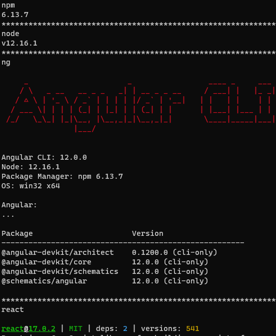

🚀🚀🚀

## 运行环境



## Component

组件将 UI 拆分为独立可复用的代码片段，并对每个片段进行独立构思，提高代码复用性通用性

#### React 

从概念上类似于 JavaScript 函数。它接受任意的入参（即 “props”），并返回用于描述页面展示内容的 React 元素。

组件必须已大写开头，React 会将以小写字母开头的组件视为原生 DOM 标签

#### Angular

基于class类的方式 

一个基础的angular组件包括。  html。 css。 ts。      

创建组件方法 `ng generate component <component-name>` 命令，其中 `<component-name>` 是新组件的名字


## React 

#### 函数是式组件
```react
//使用方法
<FunApp name='组件'/>
// Function 组件
function FunApp(props) {
  return <h1 onClick={Funclick}>函数式{props.name}</h1>
}
function Funclick() {
  console.log('Functio Component')
}

```
#### 类式组件
```react
//使用方法
<ClassApp name='组件'>
  
class ClassApp extends React.Component {
  constructor(props) {
    super(props);
    this.state = { date: new Date() };
  }
  ClassClick() {
    console.log('Class Component')
  }
  // 初始化
  componentDidMount() {
    this.timerID = setInterval(
      () => this.tick(),
      1000
    );
  }
  // Dom移除
  componentWillUnmount() {
    clearInterval(this.timerID);
  }
  //State 的更新可能是异步的
  // 出于性能考虑，React 可能会把多个 setState() 调用合并成一个调用。
  // 因为 this.props 和 this.state 可能会异步更新，所以你不要依赖他们的值来更新下一个状态。
  // 调用setState会自动把更新的数据合并到state
  tick() {
    this.setState({
      date: new Date()
    });
  }
  render() {
    return <h1 onClick={this.ClassClick}>类式{this.props.name}，时间{this.state.date.toLocaleTimeString()}</h1>
  }
}
```


#### hook

```react
//组件使用方法
<AppHook name = 'Hook'/>
// Function 组件进化版   Hook    React.useState.    React.useEffect
// useState  会保存上一次的值
function AppHook(props) {
  const [count, SetCount] = React.useState(0)
  React.useEffect(() => {
    SetCount(count + 1)
  }, [])

  return (
    <div>
      <h1 onClick={HookClick}>AppHook {count}{props.name}</h1>
    </div>
  )
}
function HookClick(){
  console.log('HookClick')
}


//可以直接在HTML中插入js
function NumberList(props) {
  const numbers = props.numbers;
  return (
    <ul>
      {/* 兄弟组件之间必须要有Key */}
      {numbers.map((number) =>
        <div key={number}>{number}</div>
      )}
    </ul>
  );
}
```

React 组件更新 只更新它需要更新的部分
React DOM 会将元素和它的子元素与它们之前的状态进行比较，并只会进行必要的更新来使 DOM 达到预期的状态。而不是一视同仁地随着时间修改整个界面

#### 消息传递

##### 父组件向子组件通信

这是最简单也是最常用的一种通信方式：父组件通过向子组件传递 props，子组件得到 props

```ts
//父组件
import Sub from "./SubComponent.js";
export default class App extends Component{
    render(){
        return(
            <div>
                <Sub title = "我是一个子组件" />
            </div>
        )
    }
}
//子组件
const Sub = (props) => {
    return(
        <h1>
            { props.title }
        </h1>
    )
}
export default Sub;

```

##### 子组件向父组件通信

利用回调函数，可以实现子组件向父组件通信：父组件将一个函数作为 props 传递给子组件，子组件调用该回调函数，便可以向父组件通信。

```ts
//父组件
import Sub from "./SubComponent.js";
export default class App extends Component{
    callback(msg){
        console.log(msg);
    }
    render(){
        return(
            <div>
                <Sub callback = { this.callback.bind(this) } />
            </div>
        )
    }
}
//子组件
const Sub = (props) => {
    const cb = (msg) => {
        return () => {
            props.callback(msg)
        }
    }
    return(
        <div>
            <button onClick = { cb("我们通信把") }>点击我</button>
        </div>
    )
}

export default Sub;

```


## angular

angular数据更新会把当前最小标签里的数据重新渲染

```ts
import { Component, EventEmitter, Input, OnInit, Output } from '@angular/core';

@Component({
  selector: 'app-test1',//组件名
  templateUrl: './test1.component.html',//模版
  styleUrls: ['./test1.component.less']//样式
})
export class Test1Component implements OnInit {

  constructor() { }
  // angular 使用@Input @Output进行传参进行组件之间传参

  @Input() date!: any;

  @Output() private testoutput = new EventEmitter<string>();
  testclick() {
    this.testoutput.emit('11111111')
  }

  // 相当于ngOnChange   检测数据变化
  @Input()
  get name(): string { return this._name; }
  set name(name: string) {
    this._name = name;
  }
  private _name: string = ''
  ngOnInit(): void {
  }

}

```

#### 消息传递

##### 父组件向子组件通信

``` ts
//父组件向子组件通过属性传递信息
<app-childen [data]="parent_data"></app-childen>
//子组件通过@Input接受信息
@Input() data: string;
//在ts文件里可以通过this.data读取父组件传过来的数据
//在html直接使用data即可展示父组件传输的数据
```

##### 子组件向父组件通信

```ts
//子组件传递信息给父组件
@Output() private testoutput = new EventEmitter<string>();

testclick() {
  /**
  * 实例化EventEmitter，赋值给event，event被@Output装饰器定义为输出属性，
  * 这样event具备了向上级传递数据的能力，通过调用EventEmitter类中定义的emit方法，
  * 来向上传递数据
  */
    this.testoutput.emit('11111111')
  }

//父组件通过事件接收子组件外传的信息
<app-test1  [name]='name' [date]='date' (testoutput)='testoutput($event)'></app-test1>

testoutput(event: any) {
  console.log(event);//11111111
}
```


