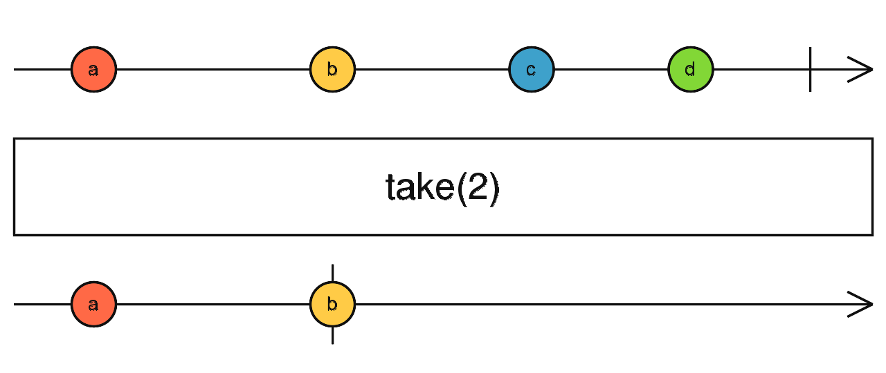
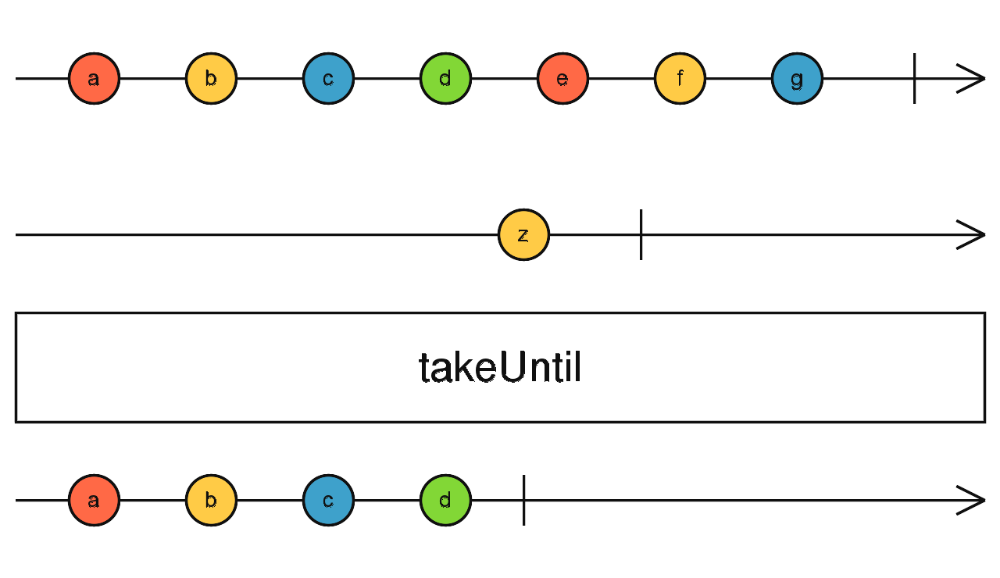

### 关于rxjs

RxJS 是一个库，它通过使用 observable 序列来编写异步和基于事件的程序。它提供了一个核心类型 ，附属类型 (Observer、 Schedulers、 Subjects) 和受 [Array#extras] 启发的操作符 (map、filter、reduce、every, 等等)，这些数组操作符可以把异步事件作为集合来处理。
> 可以把 RxJS 当做是用来处理事件的 Lodash 。

### audit和auditTime

`audit`  `auditTime` 都可用于数据节流，差异在于`audit` 在由另一个 Observable 确定的持续时间内忽略源值

 #### audit

###### 使用方法：audit(v => interval(1000))

###### 作用：在由另一个 Observable 确定的持续时间内忽略源值，然后从源 Observable 发出最新值，然后重复此过程

###### 原理图


```ts
   range(1,3000)
      .pipe(v=>interval(1000))
      .pipe(audit(v=>interval(3000)))
      .subscribe(x=>console.log(new Date(), x))
```


###### 效果图


 #### auditTime

###### 使用方法 auditTime(number)

作用： 忽略源值`duration`毫秒，然后从源 Observable 发出最新值，然后重复此过程。

###### 原理图


```ts
 range(1,3000)
      .pipe(v=>interval(1000))
      .pipe(auditTime(3000))
      .subscribe(x=>console.log(new Date(), x))
```

###### 效果图


### take和takeUntil

`take`  	用来获取数据流中的前几位数据；

`takeUntil` 通过事件来触发，终止主数据源；

#### take
###### 使用方法：take(number)
###### 作用： 获取数据流中的前几位

###### 原理图：



```ts
import { take } from 'rxjs/operators';
import { range } from 'rxjs';

range(1, 10)
  .subscribe(console.log)//1,2,3,4,5,.....,10

range(1,10)
	.pipe(take(5))
	.subscribe(console.log)//1,2,3,4,5
```
###### 效果图


#### takeUntil
###### 使用方法：takeUntil(event)
###### 作用： 接收可观察对象，可观察对象发出值时，终止主数据源

###### 原理图：



```ts
import { takeUntil } from 'rxjs/operators';
import { fromEvent } from 'rxjs';
    
fromEvent(document, 'mousemove')
      .pipe(takeUntil(fromEvent(document, 'click')))
      .subscribe(console.log);
```
###### 效果图
没有使用`takeUntil`时会一直触发鼠标的`mousemove`


使用`takeUntil`之后通过`click`事件来终止主数据源


