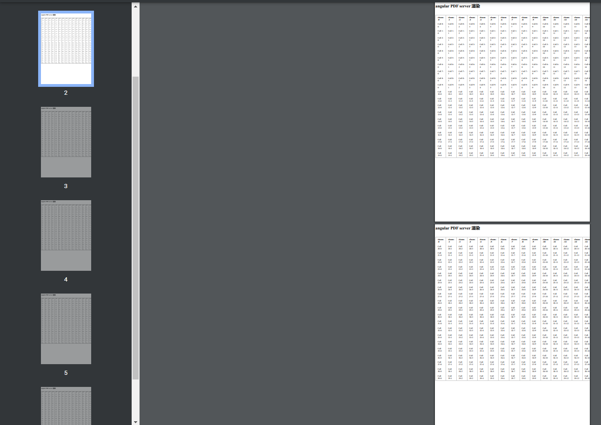
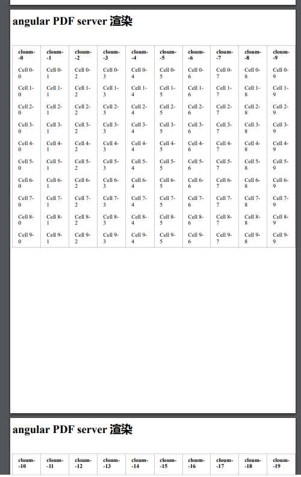

### Angular PDf server 端渲染
#### 1. 环境准备 
``` bash 
     _                      _                 ____ _     ___
    / \   _ __   __ _ _   _| | __ _ _ __     / ___| |   |_ _|
   / △ \ | '_ \ / _` | | | | |/ _` | '__|   | |   | |    | |
  / ___ \| | | | (_| | |_| | | (_| | |      | |___| |___ | |
 /_/   \_\_| |_|\__, |\__,_|_|\__,_|_|       \____|_____|___|
                |___/
Angular CLI: 16.0.0
Node: 16.14.0
Package Manager: npm 8.3.1
OS: darwin arm64
Angular: 
Package                      Version
------------------------------------------------------
@angular-devkit/architect    0.1600.0 (cli-only)
@angular-devkit/core         16.0.0 (cli-only)
@angular-devkit/schematics   16.0.0 (cli-only)
@schematics/angular          16.0.0 (cli-only)


"express": "^4.18.2",
"handlebars": "^4.7.7",
"puppeteer": "^20.1.2",
```

#### 2. 新建一个  angular 项目并在项目下启动一个 express 服务，用于数据的获取和 PDF 的渲染导出

  1. 创建一个新项目 
     ```bash 
     ng new server-pdf
     ```

2. 修改 `app.component.html` 和 `app.component.ts`

   添加一个 到处按钮， 导出当前在后端获取回来的list

   `app.component.html`
   
   ```ts
   <div>
       <h1>angular PDF server 渲染</h1>
       <button (click)="downloadPdf()"> Export to PDF</button>
       <div class="line">
   
       </div>
       <table id="list">
           <thead>
               <tr>
                   <th *ngFor="let item of titleList">{{item}}</th>
               </tr>
           </thead>
           <tbody>
               <tr *ngFor="let item of data">
                   <td *ngFor="let item of data; let i = index">{{ getcloumName(i, item) }}</td>
               </tr>
           </tbody>
       </table>
   </div>
   ```
   
   `app.component.ts`
   

init 时，从后端获取数据，并渲染到页面

   ```ts
   import { Component, OnInit } from '@angular/core';
   import { HttpClient } from '@angular/common/http';
   @Component({
       selector: 'app-root',
       templateUrl: './app.component.html',
       styleUrls: ['./app.component.less']
   })
   export class AppComponent implements OnInit {
       data: {
           name: string;
           age: string;
           gender: string;
       }[] = []
       constructor(private http: HttpClient) { }
       ngOnInit() {
           this.getData();
       }
       getData(): void {
           this.http.get('/api/data').subscribe((data: any) => {
               this.data = data.users;
           });
       }
       downloadPdf(): void {
           this.http.get('/api/pdf', {
             responseType: 'blob'
           }).subscribe((pdfBlob: Blob) => {
             const pdfUrl = URL.createObjectURL(pdfBlob);
             const downloadLink = document.createElement('a');
             downloadLink.href = pdfUrl;
             downloadLink.download = 'angular-pdf.pdf';
             downloadLink.click();
           });
         }
   }
   ```

3. 在项目的根目录下 创建 `server`文件夹
   1. 创建 `template.hbs` template  
   
      创建要转换为 PDF 的 HTML 元素
   
        ```ts
      <div>
          <h1>angular PDF server 渲染</h1>
          <div class="line">
          </div>
          <table id="list">
              <thead>
                  <tr>
                      {{#each cloumKey}}
                      <th>{{this}}</th>
                      {{/each}}
                  </tr>
              </thead>
              <tbody>
                  {{#each users}}
                  <tr>
                      {{#each this}}
                      <td>{{this}} {{[`cloum--${@index}`]}}</td>
                      {{/each}}
                  </tr>
                  {{/each}}
              </tbody>
          </table>
      </div>
        ```
    
   2. 创建 `server.js`
   
   当前端在请求`/api/pdf` 这个接口时，后端拿到当前页面渲染的数据，使用 `handlebars` 定义的 template 将数据转换为 HTML 格式，然后再使用 `puppeteer` 创建一个无头浏览器，创建空白页，将 `handlebars` 创建的 HTML 放进 浏览器中转换为 PDF 以`Buffer` 的格式传输给前端，传输完毕关闭 虚拟浏览器
   
   导入 `handlebars` `express` `fs` 和创建好的 handlebars template
   
   ```ts
   const express = require('express');
   const handlebars = require('handlebars');
   const fs = require('fs');
   const templatePath = './server/template.hbs';
   // 创建一个Express应用程序
   const app = express();
   const port = 3000;
   // 创建一个 50 * 50 的 table 表格数据
   const json = [];
   for (var i = 0; i < 50; i++) {
     var row = {};
     for (var j = 0; j < 50; j++) {
       var cellKey = 'cloum--' + j;  // 列的属性名
       var cellValue = 'Cell ' + i + '-' + j;  // 列的值
       row[cellKey] = cellValue;
     }
     json.push(row);
   }
   const data = {
       users: json
   }
   // 设置路由处理程序
   app.get('/api/data', (req, res) => {
       res.json(data);
   });
   app.get('/api/pdf', async (req, res) => {
       // 读取模板文件
       let html;
       fs.readFile(templatePath, 'utf8', (err, template) => {
           if (err) {
               console.error('Error reading template:', err);
               // 处理错误
               return;
           }
           // 编译模板
           const compiledTemplate = handlebars.compile(template);
           // 应用数据到模板
           html = compiledTemplate(data);
       });
       const puppeteer = require('puppeteer');
       // 创建一个无头浏览器
       const browser = await puppeteer.launch();
       // 创建一个新页面
       const page = await browser.newPage();
       // 将 handlebars 生成的 html 放入浏览器中
       await page.setContent(html);
       // 将当前页面 转化成 PDF buffer
       const pdfBuffer = await page.pdf({ format: 'A4' });
       res.setHeader('Content-Type', 'application/pdf');
       res.setHeader('Content-Disposition', 'attachment; filename="example.pdf"');
       // 发送给前端
       res.send(pdfBuffer);
       // 关闭浏览器实例
       await browser.close();
   });
   // 启动服务器
   app.listen(port, () => {
       console.log(`Server listening on port ${port}`);
   });
   ```

   

   3. 创建 `proxy.conf.json` 将前端的请求都转发到 server.js 中
        ```ts
        {
            "/api/*": {
            "target": "http://localhost:3000",
            "secure": false,
            "logLevel": "debug"
            }
        }
        ```
        
        
        

  在 package.json 中修改前端启动命令，增加server 启动命令
  ```ts
    "start": "ng serve --proxy-config proxy.conf.json",
    "server": "node ./server/server.js"
  ```

以上就是angular PDF server 渲染完整流程

#### 1. row 行数过多时如何分页

这里有一个 5*100 的table 表格，规定每页只能显示 20 条数据通过分页处理

1. 将 100 * 100 的 table data 切成 五个 100 * 20 数据

   ```ts
      function cutData(data) {
            const pageSize = 20;
            const listData = [];
            const len = data.length;
            const count = Math.ceil(len / pageSize);
            const cloumKey = [];
            for (let i = 0; i < count; i++) {
              const start = i * pageSize;
              const end = start + pageSize;
              const arr = data.slice(start, end);
              cloumKey.push(Object.keys(arr[0]))
              listData.push(arr);
            }
            return { listData, cloumKey };
      }
   ```
   
2. 修改 `get('/api/pdf')` 方法

使用 `cutData` 方法将原有的 100 * 100 的数据分割成 五个 100 * 20 
然后循环生成的数据依次放入 `handlebars` 的 template 中 ，去生成每页的 html
拿到 html  使用 `puppeteer` 将其转化为 PDF 并保存在本地 创建一个数据将当前创建的 PDF name保存下来供后面PDF合并使用
将分页的 PDF 全部生成完之后 使用 `pdf-lib` 把刚才生成的 PDF 合并成一个 效果图如下



```ts
app.get('/api/pdf', async (req, res) => {
    // 读取模板文件
    let html;
    const puppeteer = require('puppeteer');
    const browser = await puppeteer.launch();
    const page = await browser.newPage();
    const pdfFiles=[];
    const tableData = cutData(data.users);
    console.log('%c [ tableData ]-39', 'font-size:13px; background:pink; color:#bf2c9f;', tableData)
    for (let i = 0; i < tableData.cloumKey.length + 1; i++) {
      fs.readFile(templatePath, 'utf8', (err, template) => {
          if (err) {
              console.error('Error reading template:', err);
              // 处理错误
              return;
          }
          // 编译模板
          const compiledTemplate = handlebars.compile(template);
          // 应用数据到模板
          const pdfData = {
            users: tableData.listData[i],
            cloumKey: tableData.cloumKey[i]
          }
          html = compiledTemplate(pdfData);
      });
      await page.setContent(html);
      var pdfFileName =  'sample'+(i+1)+'.pdf';
      await page.pdf({path: __dirname + pdfFileName,format: 'A4' });
      pdfFiles.push(pdfFileName);
    }
    res.setHeader('Content-Type', 'application/pdf');
    res.setHeader('Content-Disposition', 'attachment; filename="example.pdf"');
    // 关闭浏览器实例
    await browser.close();
    const pdfBytes = await mergePDF(pdfFiles);
    res.send(pdfBytes);

});


const mergePDF = async (sourceFiles) => {
  const pdfDoc = await PDFDocument.create()
  for(let i = 0;i<sourceFiles.length;i++) {
    const localPath = __dirname + sourceFiles[i]
    const PDFItem = await PDFDocument.load(fs.readFileSync(localPath))
    for(let j = 0;j<PDFItem.getPageCount();j++) {
      const [PDFPageItem] = await pdfDoc.copyPages(PDFItem, [j])
      pdfDoc.addPage(PDFPageItem)
    }
  }
  const pdfBytes = await pdfDoc.save()
  fs.writeFileSync('samplefina555555l.pdf', pdfBytes)
  return pdfBytes;
}

```


#### 1. column 列数过多时数据如何切分

一共 20列， 将每十列切成一个数组，使用上面的 `get('/api/pdf')` 方法进行渲染传输
```ts
    function cutData(data) {
      const pageSize = 10;
      const listData = [];
      const columKey = Object.keys(data[0]);
      const len = columKey.length;
      const count = Math.ceil(len / pageSize);
      const cloumKey = [];
      for (let i = 0; i < count; i++) {
        const start = i * pageSize;
        const end = start + pageSize;
        const arr = data.slice(start, end);
        for (let j = 0; j < arr.length; j++) {
          arr[j] = _.pick(arr[j], columKey.slice(start, end));
        }
        cloumKey.push(columKey.slice(start, end));
        listData.push(arr);
      }
      return { listData, cloumKey };
    }
```

效果图如下




