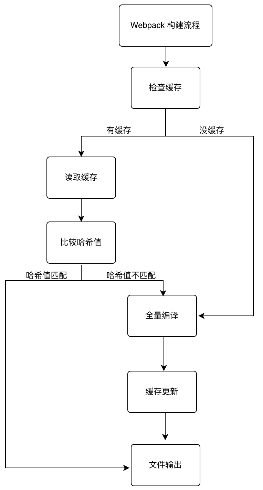

#### 1.  cache 如何进行变更检测，判断数据有没有变化
   运行构建命令时，Webpack 会根据文件内容的变化生成新的哈希值，并将新的文件存储在缓存中。
   <!-- 在浏览器中重新加载页面时，浏览器会检查缓存的文件哈希值是否匹配 -->
   可以使用 [contenthash] 或 [chunkhash] 来生成文件的哈希，确保文件内容发生变化时哈希值也会发生变化。
   当你对源文件进行更改并重新构建时，Webpack 会生成一个带有新哈希的文件，并在引用文件的 HTML 中自动更新哈希值。
   
   ```ts
   // contenthash demo
   function getContentHash(filePath) {
      const fileContent = fs.readFileSync(filePath);
      const hash = CryptoJS.MD5(fileContent).toString(CryptoJS.enc.Hex);
      return hash;
  }

  // webpack 检测代码更新
  /**
    * @template T
    * @param {string} identifier the cache identifier
    * @param {Etag | null} etag the etag
    * @param {CallbackCache<T>} callback signals when the value is retrieved
    * @returns {void}
    */
    get(identifier, etag, callback) {
      const gotHandlers = [];
      this.hooks.get.callAsync(identifier, etag, gotHandlers, (err, result) => {
        if (err) {
          callback(makeWebpackError(err, "Cache.hooks.get"));
          return;
        }
        if (result === null) {
          result = undefined;
        }
        if (gotHandlers.length > 1) {
          const innerCallback = needCalls(gotHandlers.length, () =>
            callback(null, result)
          );
          for (const gotHandler of gotHandlers) {
            gotHandler(result, innerCallback);
          }
        } else if (gotHandlers.length === 1) {
          gotHandlers[0](result, () => callback(null, result));
        } else {
          callback(null, result);
        }
      });
    }
    
    /**
	 * @template T
	 * @param {string} identifier the cache identifier
	 * @param {Etag | null} etag the etag
	 * @param {T} data the value to store
	 * @param {CallbackCache<void>} callback signals when the value is stored
	 * @returns {void}
	 */
	store(identifier, etag, data, callback) {
		console.log('store');
		this.hooks.store.callAsync(
			identifier,
			etag,
			data,
			makeWebpackErrorCallback(callback, "Cache.hooks.store")
		);
	}
   ```
#### 2. cache 实现原理图 和 compile 关系， 流程 更新机制

   
#### 3. 在 angular.json 中所写的 webpack 配置是如何注入到 webpack中的
  ```ts
  // 如何将json 插入到webpack
  // https://github.dev/angular/angular-cli
  // angular/angular-cli/packages/angular_devkit/build_angular/src/tools/webpack/plugins/karma/karma.ts
  
  const webpackConfig = config.buildWebpack.webpackConfig;
  // 配置输出路径
  webpackConfig.output.path = `/${KARMA_APPLICATION_PATH}/`;
  webpackConfig.output.publicPath = `/${KARMA_APPLICATION_PATH}/`;

  // 将 angular.json 中的 webpack 配置放入 webpack 编译器中
  const compiler = webpack(webpackConfig, (error, stats) => {
    if (error) {
      throw error;
    }

    if (stats?.hasErrors()) {
      // Only generate needed JSON stats and when needed.
      const statsJson = stats?.toJson({
        all: false,
        children: true,
        errors: true,
        warnings: true,
      });

      logger.error(statsErrorsToString(statsJson, { colors: true }));

      if (config.singleRun) {
        // Notify potential listeners of the compile error.
        emitter.emit('load_error');
      }

      // Finish Karma run early in case of compilation error.
      emitter.emit('run_complete', [], { exitCode: 1 });

      // Emit a failure build event if there are compilation errors.
      failureCb();
    }
  });
  // .run 执行编译
  compiler.hooks.run.tapAsync('karma', (_: any, callback: () => void) => handler(callback));
  ```
  
  #### 4.如何将 webpack 配置抽成 json
  
```ts

  const path = require('path');
  const webpack = require('webpack')
  const webpackConfig = {
      "entry": "./index.js",
      "output": {
          "filename": "main.[contenthash:6].js",
          "path": path.resolve(__dirname, 'dist')
      },
      "cache": {
          "type": "filesystem",
          "cacheDirectory": path.resolve(__dirname, '.cache')
      }
  };
  // 创建 webpack 编译器
  const compiler = webpack(webpackConfig)
  // 运行 webpack 编译
  compiler.run((err, stats) => {
      if (err) {
          console.error(err);
          return;
      }
      console.log(stats.toString());
  });
```
#### 5.抽象出来的 webpack config 有没有可能可以换成第三方打包工具加速这个过程
将 webpack 换成 vite
```ts
// npm install vite
// package.json script 添加 "vitedev":"vite build"
// 创建 vite.config.js 写入一下文件。执行 vitedev 时会自动使用 vite.config.js
import path from 'path';
import config from './config';
module.exports = {
    plugins: [],
    build: {
        rollupOptions: {
            input: path.resolve(__dirname, config.entry),
            output: {
                entryFileNames: config.output.filename, // 打包的文件名
                chunkFileNames: "[name].js", // 代码分割后的文件名 
                assetFileNames: "[name][extname]", // 资源文件的文件名
            },
        },
    },
};

```

   
   
   
   
   
   
   
   
   
   
   
   
   
   
   
   
   
   
   

   <!-- 查看 cache 那些文件  npx webpack --cache 


   Webpack 缓存存储了构建过程中的一些中间结果，包括模块的转换、依赖关系和生成的代码等。你可以查看缓存来了解缓存了哪些内容以及它们的具体结构。

对于使用 'filesystem' 缓存类型的情况，缓存的数据存储在指定的缓存目录中，通常是一个文件或多个文件。你可以通过查看这些文件的内容来了解缓存了哪些数据。

另外，Webpack 还提供了一些工具和插件，可以帮助你查看和分析缓存。以下是一些常用的方法：

使用 webpack-cli 命令行工具：

通过 webpack-cli 提供的命令行参数，你可以查看关于缓存的一些信息。例如，可以使用 --cache 参数来显示有关缓存的详细信息：

css
Copy code
npx webpack --cache
运行以上命令后，Webpack 将显示缓存相关的信息，包括缓存目录路径、缓存键列表等。

使用 cache-loader 插件的 report 选项：

如果你在 Webpack 配置中使用了 cache-loader 插件，并配置了 report: true，则插件会在构建过程中生成关于缓存的报告信息。这个报告会显示哪些模块使用了缓存，并提供详细的缓存命中情况。

```javascript
Copy code
const CacheLoader = require('cache-loader');

module.exports = {
  // ...
  module: {
    rules: [
      {
        test: /\.js$/,
        use: [
          {
            loader: 'cache-loader',
            options: {
              report: true,
            },
          },
          'babel-loader',
        ],
      },
      // 其他 loaders...
    ],
  },
  plugins: [
    new CacheLoader(),
  ],
};
```
在构建过程中，cache-loader 将生成缓存报告，其中包含了缓存的详细信息。

使用 webpack-plugin-cache-asset 插件：

webpack-plugin-cache-asset 插件可以帮助你查看缓存的内容和结构。它会生成一个可视化的报告，展示缓存的模块、依赖关系和生成的代码等信息。

首先，安装插件：

```css
Copy code
npm install webpack-plugin-cache-asset --save-dev
```
然后，在 Webpack 配置中引入并添加插件：

```javascript
Copy code
const CacheAssetPlugin = require('webpack-plugin-cache-asset');

module.exports = {
  // ...
  plugins: [
    new CacheAssetPlugin(),
  ],
};
```
运行构建后，插件将生成一个报告文件，你可以通过浏览器打开该文件，查看缓存的详细信息。

通过上述方法，你可以查看和分析 Webpack 缓存中存储的 -->


<!-- 1. 我又琢磨一下，这个cache值得再深挖一下，你再book 下一个knowledge share，把这个cache的实现原理研究一下画个图share一下。
1. 包含它cache的东西的作用？和compile的关系，流程，更新的机制等等。
2. 挺有意思的一个点是angular-cli用webpack打包，它编译和打包的时候怎么选择哪些是走cache的，哪些是走新生成的。是webpack直接提供了接口还是它自己手动喂给webpack，这个交互也挺有意思
3. 本身这是webpack的事情，angular-cli能通过配置或者其他办法教webpack做事，那它就能更好的做到和webpack解耦，解耦的方式也方便它在时机成熟的时候换用其他的编译引擎。现在有很多编译打包工具都在发展
4. 虽然我们依赖于angular的决定，我们没有google那么多人，但是知道它解耦的思想，和了解更多它配置的方式也可能会帮我们在编译，打包方面有一些进展，甚至是我们会不会有可能换用第三方的打包工具来加速这个过程。 -->