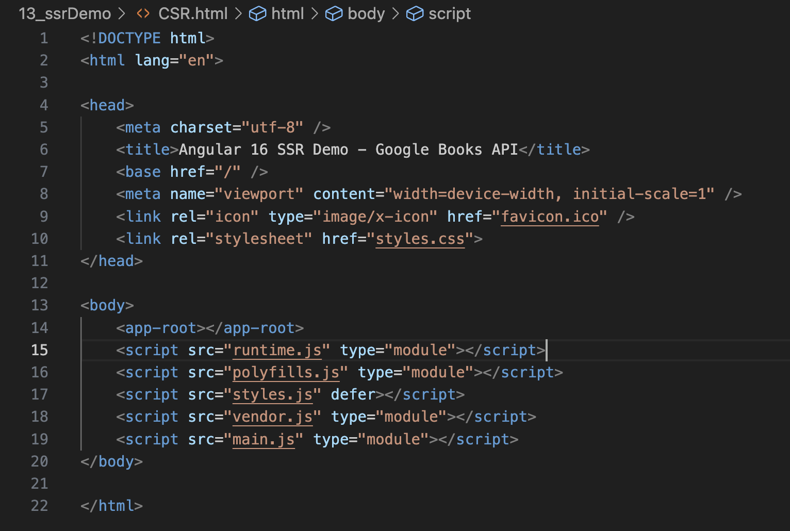
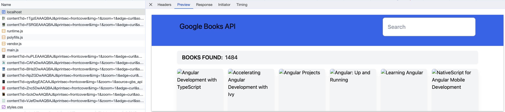
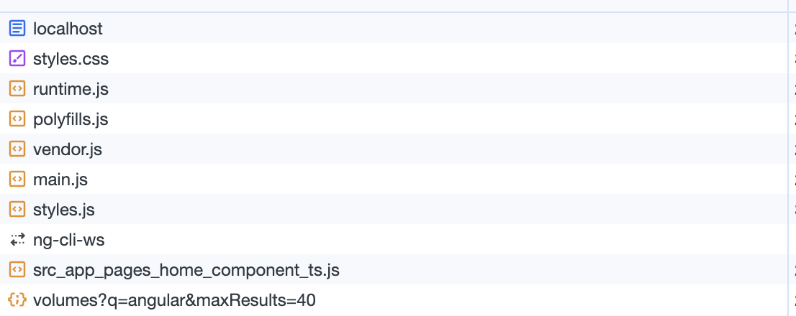

## Angular SSR 应用场景与局限
#### 应用场景
内容丰富，复杂交互的动态网页，对首屏加载有要求的项目，对 seo 有要求的项目（因为服务端第一次渲染的时候，已经把关键字和标题渲染到响应的 html 中了，爬虫能够抓取到此静态内容，因此更利于 seo）。此方式一些适合的项目：活动模板，新闻通知类，博客系统，混合开发等等。

#### SSR的优势：
##### 有利于SEO:
不同爬虫工作原理类似，只会爬取源码，不会执行网站的任何脚本（Google除外，据说Googlebot可以运行javaScript）。使用了React或者其它MVVM框架之后，页面大多数DOM元素都是在客户端根据js动态生成，可供爬虫抓取分析的内容大大减少。另外，浏览器爬虫不会等待我们的数据完成之后再去抓取我们的页面数据。服务端渲染返回给客户端的是已经获取了异步数据并执行JavaScript脚本的最终HTML，网络爬中就可以抓取到完整页面的信息。

下面使用 node 写一个简单的请求，原来获取页面内容
```js
const fs = require('fs')

fetch('http://localhost:4200')
  .then(response => response.text())
  .then(html => {
    // 使用 fs 将获取到的内容保存到本地便于比对
    fs.writeFileSync(`${__dirname}/CSR.html`, html);
    console.log('HTML:', html);
  })
  .catch(error => {
    console.error('Error fetching the page:', error);
  });
```
* 对 SSR 和 CRS 页面内容爬取做对比
  * 下图是 CSR 构建的页面，通过爬虫获取页面，可以看到只爬取到了项目打包后dist 文件中的 index.html 文件
  其中可以用于 SEO 的数据只有 Title 一行代码，对整个项目的 SEO 不太友好
 
  * 下图是 SSR 构建页面，通过爬虫获取到了
  SSR 构建的页面可以爬到页面上的所有内容，包括其中一些在后端渲染好的数据，其中读取到的数据都可以用作 SEO 


##### 有利于首屏渲染
首屏的渲染是node发送过来的html字符串，并不依赖于js文件了，这就会使用户更快的看到页面的内容。尤其是针对大型单页应用，打包后文件体积比较大，普通客户端渲染加载所有所需文件时间较长，首页就会有一个很长的白屏等待时间。

* 比对 SSR 和 CSR 首页加载速度
  * 从 Network 中可以看出 SSR 构建的页面会直接返回一个渲染好的 HTML ，等页面加载完成后才会去获取一些必要的 JS 文件，
  * CRS 构建的项目，会先去获取 JS 文件，获取完之后再去请求接口获取数据，如果 JS 文件比较大，就会有一个很长的等待时间形成一个首页白屏的问题





#### 局限
##### 服务端压力较大
本来是通过客户端完成渲染，现在统一到服务端node服务去做。尤其是高并发访问的情况，会大量占用服务端CPU资源；
##### 开发条件受限
在服务端渲染中，只会执行 ngOnInit 、 ngOnDestroy、 ngAfterViewInit、 ngAfterContentInit 等生命周期钩子，因此项目引用的第三方的库也不可用其它生命周期钩子，这对引用库的选择产生了很大的限制；


