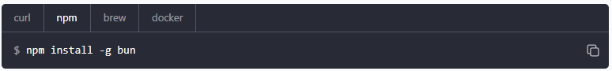
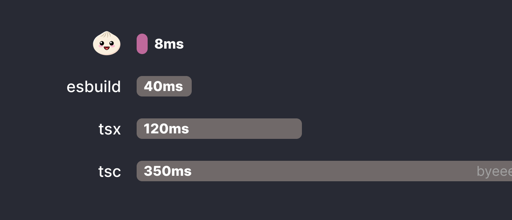
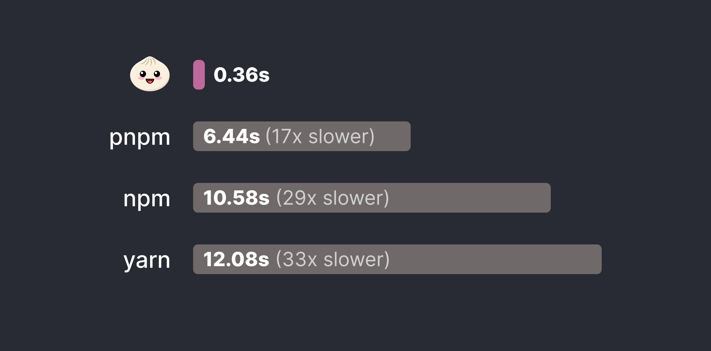

### 什么是Bun
Bun 不仅仅是一个运行时。它也是：
一个包管理器 (类似 Yarn、 NPM、 PNPM)
一个构建工具 (类似 Webpack、 ESBuild、 Parcel)
一个测试运行器
...
所以 Bun 可以通过读取 package.json 来安装依赖项。Bun 还可以运行脚本。不管它做什么都比其他工具更快。Bun 在 JavaScript 生态系统的许多方面都有新的尝试，其中的重点是性能。它优先支持标准的 Web API，如 Fetch。它也支持许多 Node.js APIs，使其能与大多数 NPM 包兼容。
### 如何安装 
Bun 目前只支持 Linux 和 macOS，Windows 尚未支持。windows用户可以使用wsl安装

```
// npm
npm install -g bun

// brew
brew tap oven-sh/bun
brew install bun

// curl
curl -fsSL https://bun.sh/install | bash

// docker
docker pull oven/bun
docker run --rm --init --ulimit memlock=-1:-1 oven/bun
```


### Bun 为什么会出现？
Bun的目标很简单，就是要消除JavaScript工具链的缓慢和复杂性，但同时保留JavaScript本身的优点。Bun希望让开发者继续使用喜欢的库和框架，并且无需放弃已经熟悉的规范和约定。

为了实现这个目标，可能需要放弃一些在使用Bun之后变得不再必要的工具：

* Node.js：Bun 的一个可以直接替代的工具，因此不再需要以下工具：
node
npx：Bun 的 bunx 命令比 npx 快5倍。
nodemon：Bun 内置了监听模式，无需使用 nodemon。
dotenv、cross-env：Bun 默认支持读取.env文件的配置。
* 转译器：Bun 可以运行.js、.ts、``.cjs、.mjs、.jsx和.tsx文件，因此不再需要以下工具：
tsc：仍然可以保留它用于类型检查！
babel、.babelrc、@babel/preset-*：不再需要使用 Babel 进行转译。
ts-node、ts-node-esm：Bun 可以直接运行 TypeScript 文件。
tsx：Bun可以直接运行 TypeScript 的 JSX 文件。
* 构建工具：Bun 具有一流的性能和与esbuild兼容的插件API，因此不再需要以下工具：
esbuild
webpack
parcel, .parcelrc
rollup, rollup.config.js
* 包管理器：Bun 是一个与 npm 兼容的包管理器，可以使用熟悉的命令。它可以读取 package.json文件并将依赖写入node_modules目录，与其他包管理器的行为类似，因此可以替换以下工具：
npm, .npmrc, package-lock.json
yarn,yarn.lock
pnpm, pnpm.lock, pnpm-workspace.yaml
lern
* 测试库：Bun是一个支持Jest的测试运行器，具有快照测试、模拟和代码覆盖率等功能，因此不再需要以下测试相关的工具：
jest, jest.config.js
ts-jest, @swc/jest, babel-jest
jest-extended
vitest, vitest.config.ts

### 兼容性
Bun 是 Node.js 的直接替代品。这意味着现有的 Node.js 应用程序和 npm 包只能在 Bun 中运行。Bun 内置了对 Node API 的支持，包括：

内置模块，如fs、path、 和net,
全局变量如__dirname和process,
以及 Node.js 模块解析算法。（例如node_modules）

Bun 针对 npm 上最流行的 Node.js 包的测试套件进行了测试。Express、Koa 和 Hono 等服务器框架就可以正常工作。

### 速度
Bun 速度很快，启动速度比 Node.js快4 倍。这种差异仅在运行 TypeScript 文件时才会被放大，该文件需要转译才能由 Node.js 运行。与使用 Google V8 引擎构建的 Node.js 和其他运行时不同，Bun 是使用 Apple 的WebKit引擎构建的。
使用相同的代码对比 node 和  bun 的执行速度
```
function fib(n) {
    if (n === 1 || n === 2) {
        return 1
    } 
    return fib(n-1) + fib(n-2)
}
console.time()
console.log(fib(45))
console.timeEnd()
```
| | 1 | 2 | 3 |
| -- | -- | -- | -- |
| node | 6.591s | 6.596s | 6.579s |
| bun | 3.35s | 3.35s | 3.35s |



### Web API
Bun 内置了对浏览器中可用的 Web 标准 API 的支持，例如fetch、Request、Response、WebSocket和ReadableStream。

```
const response = await fetch("https://example.com/");
const text = await response.text();
```

### 热重载
Bun 让您作为开发人员能够更轻松地提高工作效率。您可以运行 Bun 以--hot启用热重载，这会在文件更改时重新加载您的应用程序。

```
bun --hot server.ts
```
与硬重启整个进程的工具不同nodemon，Bun 会重新加载代码而不终止旧进程。这意味着 HTTP 和 WebSocket 连接不会断开，状态也不会丢失。


### 作为一个包管理器
```
bun install
bun add <package> [--dev|--production|--peer]
bun remove <package>
bun update <package>
```

Bun的安装速度比 npm、yarn 和 pnpm 快好几个数量级。它利用全局模块缓存来避免从npm注册表中重复下载


### Bun 测试
Bun有一个内置的测试模块bun:test，它与Jest完全兼容。
```ts
import {test, expect} from "bun:test"
test('1 + 1', () => {
    expect(1 + 1).toBe(2)
})
```
可以使用bun test命令来运行测试

从Jest或Vite迁移很简单。@jest/globals或vitest的任何导入将在内部重新映射到bun:test，因此即使不进行任何代码更改，一切也将正常运行。
```ts
import { test } from "@jest/globals";

describe("test suite", () => {
  // ...
});
```


https://bun.sh/blog/bun-v1.0

