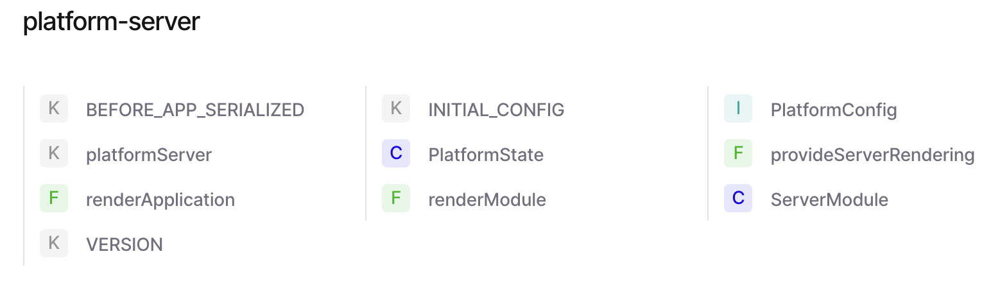

### 
```bash
ng new 16_plaform-server

ng add @nguniversal/express-engine #创建一个ssr 服务

npm run dev:ssr

node_modules/@nguniversal/express-engine

node_modules/@angular/platform-server1
```



四个常量

BEFORE_APP_SERIALIZED
platformServer
INITIAL_CONFIG
VERSION

两个Class

PlatformState
ServerModule

三个 Function 

renderApplication
renderModule
provideServerRendering

一个 Interface
PlatformConfig


#### ServerModule

```ts
import {BrowserModule} from '@angular/platform-browser';
import {NoopAnimationsModule} from '@angular/platform-browser/animations';
import {HttpClientModule} from '@angular/common/http';

@NgModule({
  exports: [BrowserModule],
  imports: [HttpClientModule, NoopAnimationsModule],
  providers: PLATFORM_SERVER_PROVIDERS,
})
export class ServerModule {}
```


#### PlatformState

```ts

export class PlatformState {
  constructor(@Inject(DOCUMENT) private _doc: any) {}

  /**
   * Renders the current state of the platform to string.
   */
  renderToString(): string {
    return serializeDocument(this._doc);
  }

  /**
   * Returns the current DOM state.
   */
  getDocument(): any {
    return this._doc;
  }
}

```


#### renderModule

```ts
// NgModule 使用 renderModule 


// app.server.module.ts
// 创建一个 app.server.module.ts  将AppModule 和 platform-server 的 ServerModule 都引入进来
import { NgModule } from '@angular/core';
import { ServerModule } from '@angular/platform-server';

import { AppModule } from './app.module';
import { AppComponent } from './app.component';

@NgModule({
  imports: [
    AppModule,
    ServerModule,
  ],
  bootstrap: [AppComponent],
})
export class AppServerModule {}


// 在 server.ts 中添加 使用 renderModule 渲染页面并返回给前端
    import { AppServerModule } from './src/main.server';
    import { renderApplication, renderModule } from '@angular/platform-server';

    // 读取打包好的 dist 中 静态文件
    const FOLDER = join(process.cwd(), 'dist/v18-ssr-demo/browser');
    server.use(express.static(FOLDER));
    // 读取 Angular 应用的 index.html 文件
    const renderHtml = readFileSync(join(FOLDER, 'index.html'), 'utf8');
    server.get('/renderModule', async (req, res) => {
        // const html = '<div>ppp</div>'
        const renderedHtml = await renderModule(AppServerModule, {
            document: renderHtml,
            url: req.url
        });
        res.status(200).send(renderedHtml);
    });


export async function renderModule<T>(
  moduleType: Type<T>,
  options: {document?: string | Document; url?: string; extraProviders?: StaticProvider[]},
): Promise<string> {
  const {document, url, extraProviders: platformProviders} = options;
  const platformRef = createServerPlatform({document, url, platformProviders});
  const moduleRef = await platformRef.bootstrapModule(moduleType);
  const applicationRef = moduleRef.injector.get(ApplicationRef);
  return _render(platformRef, applicationRef);// html
}

```


#### renderApplication
```ts
// standalone  使用  renderApplication

// app.config.ts
import { ApplicationConfig, provideZoneChangeDetection } from '@angular/core';
import { provideRouter } from '@angular/router';

import { routes } from './app.routes';
import { provideClientHydration } from '@angular/platform-browser';

export const appConfig: ApplicationConfig = {
  providers: [provideZoneChangeDetection({ eventCoalescing: true }), provideRouter(routes), provideClientHydration()]
};


//app.server.config.ts

import { mergeApplicationConfig, ApplicationConfig } from '@angular/core';
import { provideServerRendering } from '@angular/platform-server';
import { appConfig } from './app.config';

const serverConfig: ApplicationConfig = {
  providers: [
    // provideServerRendering()
  ]
};

export const config = mergeApplicationConfig(appConfig, serverConfig);


// app.server.ts
import { bootstrapApplication } from '@angular/platform-browser';
import { AppComponent } from './app/app.component';
import { config } from './app/app.config.server';

const bootstrap = () => bootstrapApplication(AppComponent, config);

export default bootstrap;


// server.ts
import bootstrap from './src/main.server';

server.get('/renderApplication', async (req, res) => {
    try {
        const renderedHtml = await renderApplication(bootstrap,{
            document: renderHtml,
            url: req.url
          });
          res.status(200).send(renderedHtml);
    } catch (error) {
        console.error('Server-side rendering error:', error);
        res.status(500).send('Internal Server Error');
    }
});


export async function renderApplication<T>(
  bootstrap: () => Promise<ApplicationRef>,
  options: {document?: string | Document; url?: string; platformProviders?: Provider[]},
): Promise<string> {
  const platformRef = createServerPlatform(options);
  const applicationRef = await bootstrap();
  return _render(platformRef, applicationRef);
}
```


#### provideServerRendering

```ts
// standalone  中使用 provideServerRendering


import { mergeApplicationConfig, ApplicationConfig } from '@angular/core';
import { provideServerRendering } from '@angular/platform-server';
import { appConfig } from './app.config';

const serverConfig: ApplicationConfig = {
  providers: [
    provideServerRendering()
  ]
};

export const config = mergeApplicationConfig(appConfig, serverConfig);


// angular/core    
provideServerRendering(): EnvironmentProviders {
  return makeEnvironmentProviders([provideNoopAnimations(), ...PLATFORM_SERVER_PROVIDERS]);
}

```


```text

在Angular框架中，NgModule（模块）是Angular应用程序的基础构建块，它将相关的组件、指令、服务和管道组织在一起。NgModule装饰器用于定义一个模块，它有几个重要的属性，包括exports、imports和providers。下面是每个属性的作用：

imports:

imports数组用于声明当前模块依赖的其他模块。
当一个模块被导入时，它将提供在exports数组中声明的所有组件、指令和管道给导入它的模块。
这允许模块之间的功能共享，例如，如果你有一个共享模块，里面包含了多个组件和指令，你可以在其他模块中导入这个共享模块，而不需要单独导入每个组件和指令。
exports:

exports数组用于声明当前模块向外公开的组件、指令和管道。
当其他模块导入当前模块时，exports数组中声明的组件、指令和管道将被其他模块使用，而不需要在其他模块中再次声明。
这有助于避免在多个模块中重复声明相同的组件和指令，保持代码的整洁和模块化。
providers:

providers数组用于声明当前模块提供的服务。
这些服务可以是Angular内置的服务，也可以是自定义的服务。
当一个服务在providers数组中声明时，它可以在整个应用程序中被注入，只要它所在的模块被导入到根模块中，或者被导入到任何其他模块中，并且这些模块的组件需要使用这些服务。
通过在模块中声明服务，Angular的依赖注入系统可以确保服务的单例模式，即在整个应用程序中只有一个服务实例。
简而言之，imports用于导入其他模块的功能，exports用于公开当前模块的功能供其他模块使用，而providers用于提供服务，这些服务可以在整个应用程序中被注入和使用。

```


