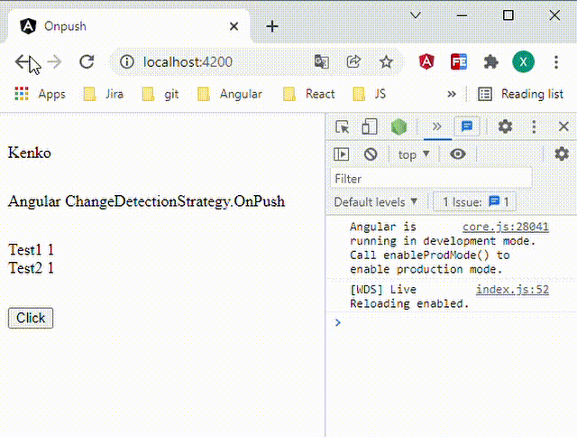
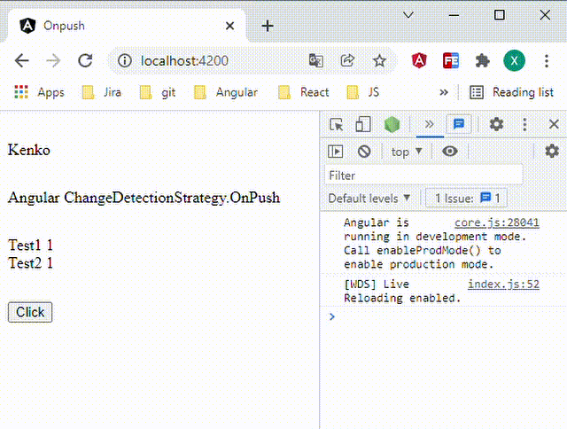

## angular 变更检测

### 变更检测是什么

当我们在 model 中改变数据时，框架层需要知道：

- model 哪里发生了改变
- view 中哪里需要更新

整个angular app 是个组件树，不可能任意一个组件中的数据发生变化，所有的组件都更新，性能比较低

Angular 除了默认的变化检测机制，也提供了`ChangeDetectionStrategy.OnPush`，用 OnPush 可以跳过某个组件或者某个父组件以及它下面所有子组件的变化检测，


举个例子，

默认情况下父组件数据更改会影响到自组件的数据




使用`ChangeDetectionStrategy.OnPush`会跳过当前组件的数据更新




test.component.ts

```TS
import { Component, OnInit } from '@angular/core';
@Component({
  selector: 'app-test',
  template: `
              <div>
                Test1 <span>{{data.Test1}}</span>
              </div>

              <app-test-child  [data]="data"></app-test-child>

              <button  (click)="onClick()">Click</button>
            `,
  styles:['*{ margin-top: 30px;}'],
})
export class TestComponent implements OnInit {
  ngOnInit(): void {
  }
  data: any = {
    Test1: 1,
    Test2: 1
  };
  onClick() {
    ++this.data.Test1;
    ++this.data.Test2;
    console.log('Test1',this.data.Test1,'Test2',this.data.Test2);
    
  }
}

```

testChild.component.ts

```TS
import { ChangeDetectionStrategy, Component, Input, OnInit } from '@angular/core';
@Component({
  selector: 'app-test-child',
  template: `<div>Test2 <span>{{data.Test2}}</span></div>`,
  // changeDetection: ChangeDetectionStrategy.OnPush
})
export class TestChildComponent implements OnInit {
  @Input() data: any;
  ngOnInit():void{
  }
}
```


