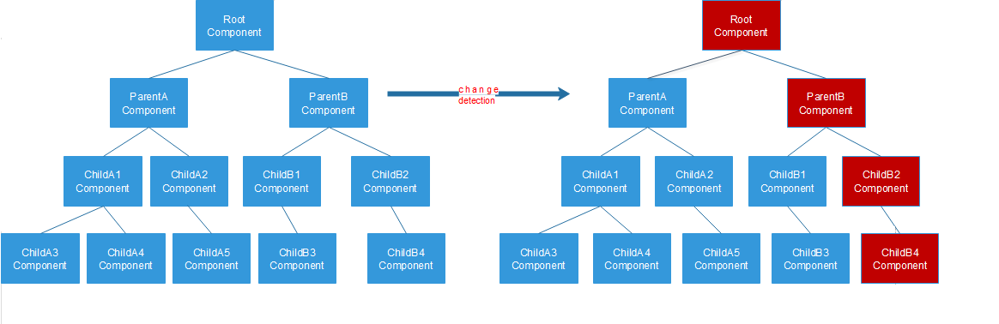

## angular 变更检测

### 变更检测是什么

当我们在 model 中改变数据时，框架层需要知道：

- model 哪里发生了改变
- view 中哪里需要更新

整个angular app 是个组件树，不可能任意一个组件中的数据发生变化，所有的组件都更新，性能比较低

Angular 除了默认的变化检测机制，也提供了`ChangeDetectionStrategy.OnPush`，用 OnPush 可以跳过某个组件或者某个父组件以及它下面所有子组件的变化检测，




### 默认的变更检测策略

默认情况下，Angular使用`ChangeDetectionStrategy.Default`策略来进行变更检测。

默认策略并不事先对应用做出任何假设，因此，每当用户事件、记时器、XHR、promise等事件使应用中的数据将发生了改变时，所有的组件中都会执行变更检测。

这种技术被称作脏检查。为了知道视图是否需要更新，Angular需要访问新值并和旧值比较来判断是否需要更新视图。

现在想象一下，如果有一个有成千上万个表达式的大应用，Angular去检查每一个表达式，我们可能会遇到性能上的问题。


### onPush 变更策略

在 `@Component`里添加`changeDetection: ChangeDetectionStrategy.OnPush`启用onPush变更策略

这将告诉angular该组件仅依赖于它的`@inputs()`,只有以下情况才需要检查

##### 1.`input`发生变化

在变更检测的上下文中使用不可变对象的好处是，Angular可以通过检查引用是否发生了改变来判断视图是否需要检查。这将会比深度检查要容易很多。

numbers, booleans, strings, null 、undefined都是原始类型。所有的原始类型都是按值传递的. Objects, arrays, 还有 functions 也是按值传递的，只不过值是

为了触发对该组件的变更检测，我们需要更改这个object的引用，来触发变更检测   

例如：

```ts
//test.component.ts
data: any = {
    Test1: 1,
    Test2: 1
  };
  data2:any = {
    Test1: 333,
    Test2: 333
  }
  onClick() {
    this.data = this.data2
    console.log('Test1',this.data.Test1,'Test2',this.data.Test2);
    
  }

```

##### 2.源于该组件或其子组件的事件

当在一个组件或者其子组件中触发了某一个事件时，这个组件的内部状态会更新。 

例如：

```ts
//testChild.component.ts
@Component({
  selector: 'app-test-child',
  template: `<div (click)="onClick()">Test2 <span>{{data.Test2}}</span></div>`,
  changeDetection: ChangeDetectionStrategy.OnPush
})
export class TestChildComponent implements OnInit {
  @Input() data: any;
  ngOnInit():void{
  }
  onClick() {
    ++this.data.Test2;
  }
}
```

点击这个div时，执行了变更检测，并更新了视图

注意，此时的`this.data.Test2`会变成父组件的`++this.data.Test2`

##### 3. 显示的去执行变更检测

angular 提供了三种方法来触发变更检测

第一个是`detectChanges()`来告诉该组件和它的子组件中去执行变更检测

```ts
constructor(private cdr: ChangeDetectorRef) {
    setTimeout(() => {
      this.data.Test2 = 9;
      this.cdr.detectChanges();
    }, 1000);
  }
```


第二个是`ApplicationRef.tick()`，它告诉Angular来对整个应用程序执行变更检测。

```ts
tick() {
  try {
    this._views.forEach((view) => view.detectChanges());
    ...
  } catch (e) {
    ...
  }
}
```


第三是`markForCheck()`，它不会触发变更检测。相反,它会将所有设置了onPush的祖先标记,在当前或者下一次变更检测循环中检测。

```ts
markForCheck(): void { 
  markParentViewsForCheck(this._view); 
}

export function markParentViewsForCheck(view: ViewData) {
  let currView: ViewData|null = view;
  while (currView) {
    if (currView.def.flags & ViewFlags.OnPush) {
      currView.state |= ViewState.ChecksEnabled;
    }
    currView = currView.viewContainerParent || currView.parent;
  }
}
```


## 代码

`test.component.ts`

```TS
import { Component, OnInit } from '@angular/core';
@Component({
  selector: 'app-test',
  template: `
              <div>
                Test1 <span>{{data.Test1}}</span>
              </div>
              <app-test-child  [data]="data"></app-test-child>
              <button  (click)="onClick()">Click</button>
            `
})
export class TestComponent implements OnInit {
  ngOnInit(): void {
  }
  data: any = {
    Test1: 1,
    Test2: 1
  };
  data2:any = {
    Test1: 333,
    Test2: 333
  }
  onClick() {
    ++this.data.Test1;
    ++this.data.Test2;
    // this.data = this.data2
    console.log('Test1',this.data.Test1,'Test2',this.data.Test2);
    
  }
}

```

`testChild.component.ts`

```TS
import { ChangeDetectionStrategy, ChangeDetectorRef, Component, Input, OnInit } from '@angular/core';

@Component({
  selector: 'app-test-child',
  template: `<div (click)="onClick()">Test2 <span>{{data.Test2}}</span></div>`,
  changeDetection: ChangeDetectionStrategy.OnPush
})
export class TestChildComponent implements OnInit {
  @Input() data: any;
  // constructor(private cdr: ChangeDetectorRef) {
  //   setTimeout(() => {
  //     this.data.Test2 = 9;
  //     this.cdr.detectChanges();
  //   }, 1000);
  // }
  ngOnInit():void{
  }
  onClick() {
    ++this.data.Test2;
  }
}

```


