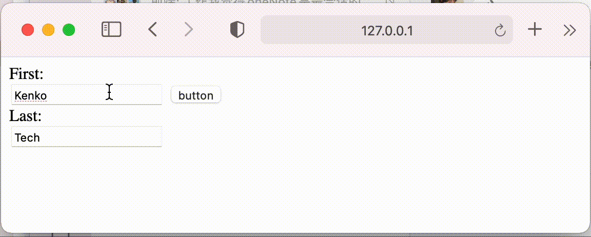

** form****表单嵌套****button** **在****input****中****Enter****触发****button.click****事件**

``` html
<!DOCTYPE html>
 <html>
 ​
 <body>
 <form>
  First:<br>
   <input type="text" name="first" value="Kenko">
   <button onclick="change()">button</button>
   <br>
  Last:<br>
   <input type="text" name="last" value="Tech">
   <br><br>
 </form>
 <script>
   function change() {
    alert('button');
  }
 </script>
 </body>
 ​
 </html>
```


(上图代码的效果)


当在input中敲击回车就会触发它旁边的button，如果一个form表单里有好几个button会导致所有的button同时被触发

无法进行进行下一步的操作

原因如下(参考MDN button type https://developer.mozilla.org/zh-CN/docs/Web/HTML/Element/button)

[**type**](https://developer.mozilla.org/zh-CN/docs/Web/HTML/Element/button#attr-type)

button的类型。可选值：

- submit: 此按钮将表单数据提交给服务器。如果未指定属性，或者属性动态更改为空值或无效值，则此值为默认值。
- reset: 此按钮重置所有组件为初始值。
- button: 此按钮没有默认行为。它可以有与元素事件相关的客户端脚本，当事件出现时可触发。
- menu: 此按钮打开一个由指定[``](https://developer.mozilla.org/zh-CN/docs/Web/HTML/Element/menu)元素进行定义的弹出菜单。

解决方法一：阻止input事件冒泡

``` html
<!DOCTYPE html>
 <html>
 ​
 <body>
 <form>
  First:<br>
   <input type="text" name="first" value="Kenko" onkeydown="keydown(event)">
   <button onclick="change()">button</button>
   <br>
  Last:<br>
   <input type="text" name="last" value="Tech">
   <br><br>
 </form>
 <script>
   function change() {
    alert('button');
  }
   function keydown(event) {
    if (event.code === 'Enter' || event.code === 'NumpadEnter') {
     event.preventDefault();
   }
  }
 </script>
 </body>
 ​
 </html>
```

解决方法二：给button加上对应的type

``` html
<button type='button'>Submit</button>
```

(这里是修改之后的效果)



 