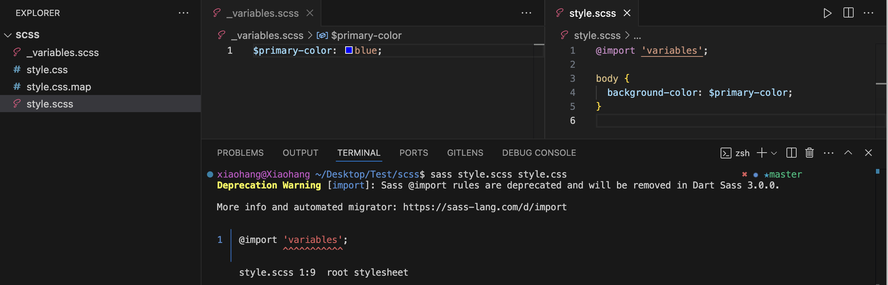
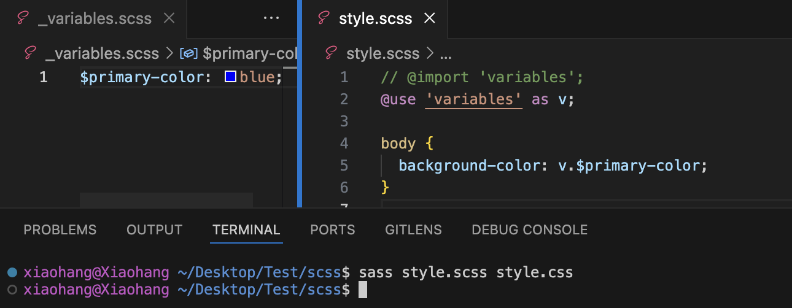
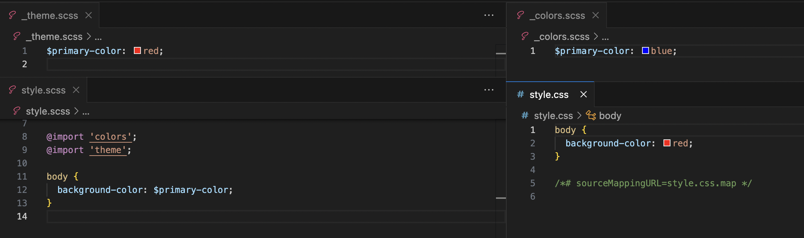
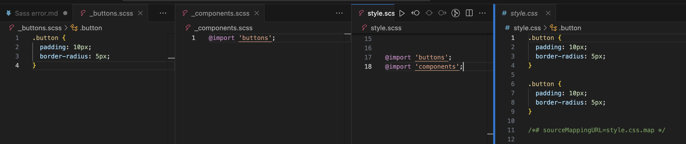

<!-- 在升级 angular 19 时升级完成后 运行前端项目发现前端有一个 error 

```
`Sass @import rules ars deprecated and will be removed in Dart Sass 3.0.0`
``` -->


# SCSS @import 警告与解决方案

## ⚠️ 警告信息
在 SCSS 中，使用 `@import` 可能会产生以下警告：

```
Deprecation Warning: Sass @import rules are deprecated and will be removed in Dart Sass 3.0.0.
```

## 📌 为什么会有这个警告？
Sass 官方已经废弃 `@import`，推荐使用 `@use` 和 `@forward` 进行模块化管理。其主要原因包括：

1. **命名冲突**：`@import` 允许多个文件共享变量和混合宏，可能导致命名冲突。
2. **重复导入**：`@import` 可能导致相同的文件被导入多次，影响编译性能。
3. **作用域问题**：`@import` 导入的所有内容都是全局的，而 `@use` 采用更严格的作用域管理，避免变量污染。

## 🔍 如何复现这个警告？

创建以下 SCSS 文件，并尝试编译：

### `_variables.scss`
```scss
$primary-color: blue;
```

### `style.scss`
```scss
@import 'variables';

body {
  background-color: $primary-color;
}
```

然后运行：
```sh
sass style.scss style.css
```
你将看到 `@import` 相关的警告信息。


## ✅ 如何正确替换 `@import`？

### `_variables.scss`
```scss
$primary-color: blue;
```

### `style.scss`
```scss
@use 'variables' as v;

body {
  background-color: v.$primary-color;
}
```
重新编辑后，警告消失


## @import 的问题示例

### **1. 命名冲突**

#### **问题**
`@import` 可能导致相同变量或 Mixin 被覆盖。

#### **示例**
**`_colors.scss`**
```scss
$primary-color: blue;
```

**`_theme.scss`**
```scss
$primary-color: red;
```

**`style.scss`**
```scss
@import 'colors';
@import 'theme';

body {
  background-color: $primary-color;
}
```

#### **结果**
最终 `body` 的 `background-color` 变为 **red**，因为 `theme.scss` 覆盖了 `colors.scss` 的值。


---

### **2. 重复导入**

#### **问题**
`@import` 可能导致相同的文件被多次导入，影响编译效率。

#### **示例**
**`_buttons.scss`**
```scss
.button {
  padding: 10px;
  border-radius: 5px;
}
```

**`_components.scss`**
```scss
@import 'buttons';
```

**`style.scss`**
```scss
@import 'buttons';
@import 'components';
```

#### **结果**
`.button` 的样式被重复生成两次，导致冗余代码。


---

### **3. 作用域问题**

#### **问题**
`@import` 导入的变量和 Mixin 作用域是全局的，可能污染其他文件的变量。

#### **示例**
**`_variables.scss`**
```scss
$padding: 20px;
```

**`_card.scss`**
```scss
@import 'variables';

.card {
  padding: $padding;
}
```

**`_button.scss`**
```scss
@import 'variables';

.button {
  padding: $padding; // 可能需要不同的 padding，但被全局变量影响
}
```

由于变量是全局的，未来如果 `variables.scss` 修改 `$padding`，所有引用的文件都会受影响，可能导致意外的样式变更。

## 🚀 `@use` 的优势
- **避免全局污染**：`@use` 采用**命名空间**（如 `v.$primary-color`），防止变量污染全局作用域。
- **避免重复导入**：`@use` 只会导入一次，优化编译性能。
- **模块化管理**：使用 `@use` 让代码更结构化，便于维护。

<!-- ## 🔥 `@import` 的潜在影响

### 🚨 1. 未来 Sass 版本不再支持，导致编译失败
`@import` 在 **Dart Sass 3.0.0** 之后将彻底移除。
如果不迁移到 `@use`，未来升级到新版本时，SCSS 代码将无法编译，影响项目的正常运行。

### 🔥 2. 变量、Mixin 和函数的作用域污染
`@import` 的导入方式是**全局导入**，这会导致变量、Mixin、函数覆盖问题，可能无意中修改其他文件中的样式，导致难以排查的 bug。

### 🏎 3. 重复导入，导致编译性能下降
`@import` 可能会多次引入相同的文件，影响编译效率。而 `@use` 只会导入一次，大幅优化性能。

### 🛠 4. Webpack / Vite / Sass-loader 可能停止支持 `@import`
- Webpack（特别是 `sass-loader` 版本较新时）可能**不再兼容 `@import`**  
- Vite 以及其他前端工具可能会**完全移除对 `@import` 的支持**  

这意味着，你的 SCSS 代码在某些构建工具中可能**无法正常工作**，必须手动进行兼容性修复。 -->

## 🚀 结论
| 问题 | `@import` | `@use` |
|------|----------|--------|
| **未来 Sass 版本支持** | ❌ 3.0.0 之后移除 | ✅ 持续支持 |
| **作用域污染** | ❌ 变量、Mixin 全局可见 | ✅ 需要显式引用 (`namespace.$var`) |
| **重复导入** | ❌ 可能多次编译相同文件 | ✅ 只导入一次 |
| **性能优化** | ❌ 影响大项目编译速度 | ✅ 提升性能 |
| **构建工具支持** | ⚠️ 未来 Webpack / Vite 可能不再支持 | ✅ 推荐做法 |

🚀 **尽早升级到 `@use`，避免未来维护成本增加！**

